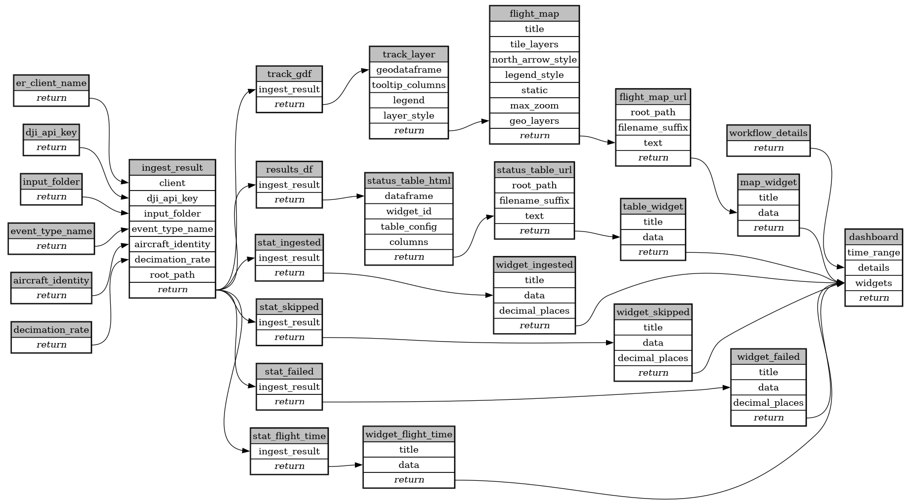

```
# AUTOGENERATED BY ECOSCOPE-WORKFLOWS; see fingerprint in README.md for details

```

```yaml
# fingerprint:
artifacts_sha256_basic: d8424c71397e171cb28012fee8e5a3063f31b4be7a9fd537ee76a28639ae5c41
artifacts_sha256_strict: 4c000395fed89ae2d410ea67a446292932a8600a925d3c6f6f5f39ffd40e2968
installed_requirements:
- channel: https://repo.prefix.dev/ecoscope-workflows/
  name: ecoscope-platform
  version: {version: ==2.11.15}
params_sha256: 1d830f798fbe7671af24edb41a9f539298b6891ee9a1f7569c18feb21b9fbc52
spec_sha256: 0bb42c3c261c1ff24629e11c1b7facc6fe56586bc3ca71da1e9542f0aa30342f

```

# ecoscope-workflows-uas-flight-logs-workflow


